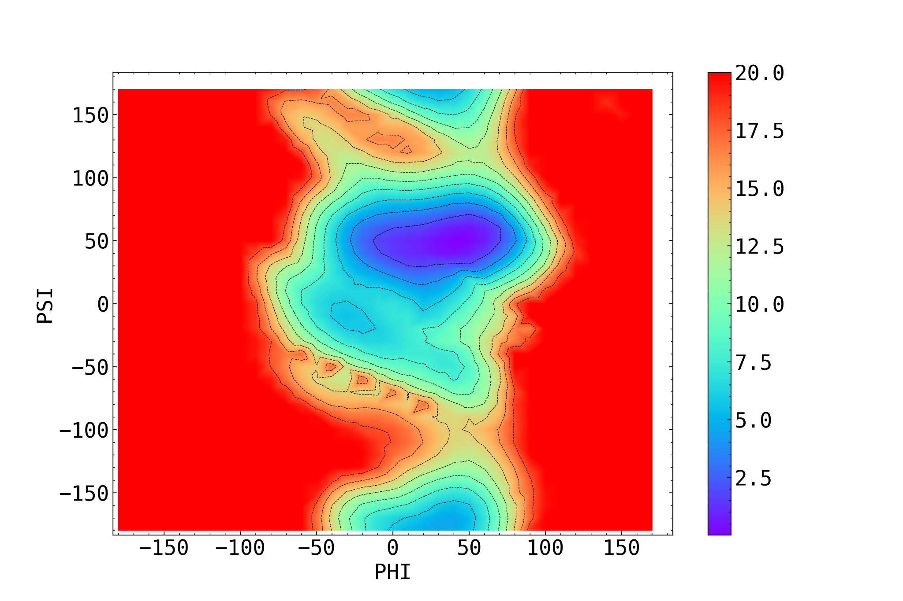
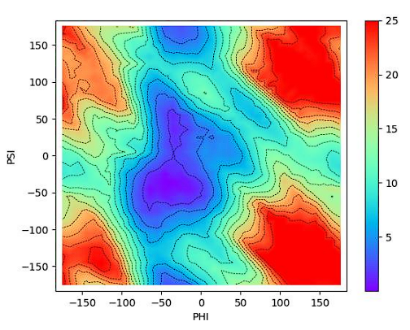

### DiMap
Dissacharide Mapping

DiMap was created as a practical alternative to **metadynamics** for exploring disaccharide conformations around the same glycosidic collective variables (**φ/ψ**). While metadynamics can provide free-energy surfaces, it typically requires long simulations, bias-parameter tuning, and convergence checks. DiMap focuses on a simpler and reproducible strategy to quickly map the relevant torsional space.

### Comparison with metadynamics (φ/ψ maps)

<table>
  <tr>
    <td align="center">
      <b>DiMap (energy-based torsional map)</b> 
      
    </td>
    <td align="center">
      <b>Metadynamics (free-energy surface)</b> 
      
    </td>
  </tr>
</table>

> **Note:** DiMap reports a minimized **potential-energy** landscape (CHARMM36 + implicit solvent), whereas metadynamics yields a **free-energy** surface (ΔG). Even so, the location of the main low-energy basins/minima can be compared qualitatively across both maps.

### What is DiMap used for?
DiMap generates an energy-based torsional map of a disaccharide by:
- scanning the **φ/ψ** space with a user-defined rotation step (e.g., 2.5°, 5°, 10°),
- rotating coordinates to generate candidate conformations,
- minimizing each conformation and evaluating its energy using **NAMD** (CHARMM36 + implicit solvent),
- reporting the resulting landscape and highlighting **local/global minima**.

These minima can then be used as **starting conformations** to build larger carbohydrate units (e.g., repetitive units with substituents) and to launch subsequent MD simulations.

### Benchmark (DiMap vs metadynamics)

The table below summarizes the **wall-clock time** required to generate φ/ψ maps for a set of 8 disaccharides (D1–D8; ~44–51 atoms), using three map resolutions (φ/ψ step size). Values are **means** across the benchmark set:

| Map resolution (φ/ψ step) | DiMap (mean wall time) | Metadynamics (mean wall time) | Mean speedup |
|---:|---:|---:|---:|
| 2.5° | 1h 49m (6,585 s) | 10h 46m (38,774 s) | 5.9× |
| 5° | 27m 2s (1,622 s) | 9h 44m (35,068 s) | 21.6× |
| 10° | 6m 48s (408 s) | 9h 48m (35,298 s) | 86.6× |

Time ranges across the benchmark set:
- **2.5°**: DiMap 1h 47m–1h 59m, metadynamics 10h 17m–11h 33m.
- **5°**: DiMap 26m 8s–29m 52s, metadynamics 9h 25m–10h 26m.
- **10°**: DiMap 6m 35s–7m 32s, metadynamics 9h 27m–10h 29m.
